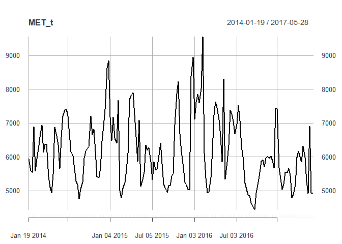
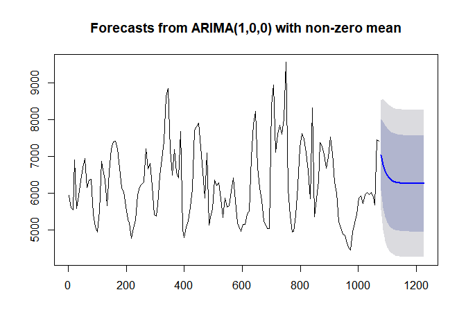
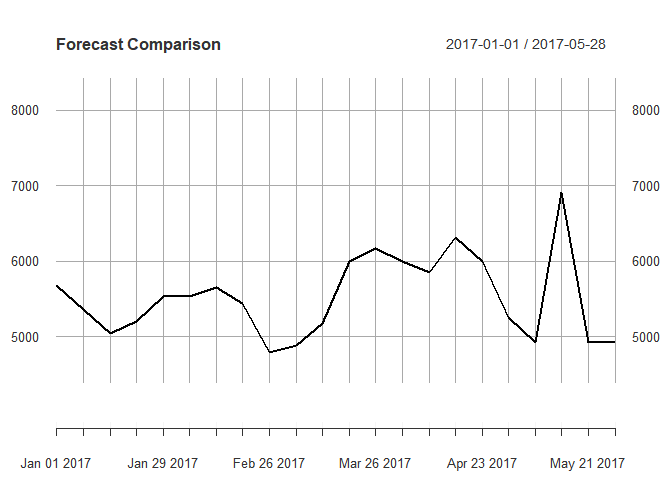
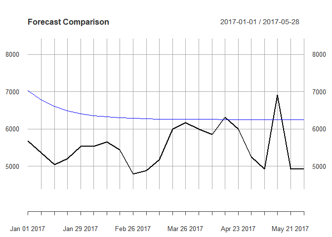

## Forecasting demand with time series
### Importing data
ransform the data into an xts object to help with analysis

```r
bev<-read.csv("https://www.dropbox.com/s/q5ib3t5ue6tfta0/Bev.csv?dl=1")
head(bev)
```

```
##   M.hi.p M.lo.p MET.hi.p MET.lo.p MET.sp.p SEC.hi.p SEC.lo.p M.hi M.lo
## 1  59.25  29.19    63.67    26.03    50.09    58.56    29.19  458 1455
## 2  56.26  26.31    60.34    25.54    48.82    54.64    26.31  477 1756
## 3  56.26  26.25    60.79    25.69    48.56    57.90    26.25  539 2296
## 4  49.33  26.15    55.09    26.46    47.74    49.70    26.15  687 3240
## 5  61.34  25.88    65.09    25.72    50.75    63.72    25.88  389 2252
## 6  61.40  27.35    67.91    26.17    52.63    68.38    27.35  399 1901
##   MET.hi MET.lo MET.sp SEC.hi SEC.lo
## 1   2037   3437    468    156    544
## 2   1700   3436    464    151    624
## 3   1747   3304    490    178    611
## 4   2371   3864    657    217    646
## 5   1741   3406    439    141    624
## 6   2072   3418    453    149    610
```

```r
# Load xts package 
library(xts)
```

```
## Loading required package: zoo
```

```
## 
## Attaching package: 'zoo'
```

```
## The following objects are masked from 'package:base':
## 
##     as.Date, as.Date.numeric
```

```
## Registered S3 method overwritten by 'xts':
##   method     from
##   as.zoo.xts zoo
```

```r
# Create the dates object as an index for your xts object
dates <- seq(as.Date("2014-01-19"), length = 176, by = "weeks")

# Create an xts object called bev_xts
bev_xts <- xts(bev, order.by = dates)
head(bev_xts)
```

```
##            M.hi.p M.lo.p MET.hi.p MET.lo.p MET.sp.p SEC.hi.p SEC.lo.p M.hi
## 2014-01-19  59.25  29.19    63.67    26.03    50.09    58.56    29.19  458
## 2014-01-26  56.26  26.31    60.34    25.54    48.82    54.64    26.31  477
## 2014-02-02  56.26  26.25    60.79    25.69    48.56    57.90    26.25  539
## 2014-02-09  49.33  26.15    55.09    26.46    47.74    49.70    26.15  687
## 2014-02-16  61.34  25.88    65.09    25.72    50.75    63.72    25.88  389
## 2014-02-23  61.40  27.35    67.91    26.17    52.63    68.38    27.35  399
##            M.lo MET.hi MET.lo MET.sp SEC.hi SEC.lo
## 2014-01-19 1455   2037   3437    468    156    544
## 2014-01-26 1756   1700   3436    464    151    624
## 2014-02-02 2296   1747   3304    490    178    611
## 2014-02-09 3240   2371   3864    657    217    646
## 2014-02-16 2252   1741   3406    439    141    624
## 2014-02-23 1901   2072   3418    453    149    610
```

### Plotting / visualizing data
The column names for the sales of these three products are MET.hi(high end products), MET.lo( low end products), and MET.sp(specialty products)

```r
# Create the individual region sales as their own objects
MET_hi <- bev_xts[,"MET.hi"]
MET_lo <- bev_xts[,"MET.lo"]
MET_sp <- bev_xts[,"MET.sp"]

# Sum the region sales together
MET_t <- MET_hi + MET_lo + MET_sp

# Plot the metropolitan region total sales
plot(MET_t)
```

<!-- -->


```r
library(forecast)
```

```
## Registered S3 method overwritten by 'quantmod':
##   method            from
##   as.zoo.data.frame zoo
```

```
## Registered S3 methods overwritten by 'forecast':
##   method             from    
##   fitted.fracdiff    fracdiff
##   residuals.fracdiff fracdiff
```

```r
# Split the data into training and validation
MET_t_train <- MET_t[index(MET_t) < "2017-01-01"]
MET_t_valid <- MET_t[index(MET_t) >= "2017-01-01"]

# Use auto.arima() function for metropolitan sales
MET_t_model<-auto.arima(MET_t_train)

# Forecast the first 22 weeks of 2017
forecast_MET_t <- forecast(MET_t_model, h = 22)

# Plot this forecast #
plot(forecast_MET_t)
```

<!-- -->

```r
# Convert to numeric for ease
for_MET_t <- as.numeric(forecast_MET_t$mean)
v_MET_t <- as.numeric(MET_t_valid)

# Calculate the MAE
MAE <- mean(abs(for_MET_t - v_MET_t))

# Calculate the MAPE
MAPE <- 100*mean(abs(for_MET_t - v_MET_t)/v_MET_t)

# Print to see how good your forecast is!
print(MAE)
```

```
## [1] 898.8403
```

```r
print(MAPE)
```

```
## [1] 17.10332
```

```r
# Convert your forecast to an xts object
for_dates <- seq(as.Date("2017-01-01"), length = 22, by = "weeks")
for_MET_t_xts <- xts(forecast_MET_t$mean, order.by = for_dates)

# Plot the validation data set
plot(MET_t_valid, main = 'Forecast Comparison', ylim = c(4000, 8500))
```

<!-- -->

```r
# Overlay the forecast of 2017
lines(for_MET_t_xts, col = "blue")
```

<!-- -->

```r
# No wonder our MAPE was over 17% on average!

# Confidence Intervals for Forecast
# Plot the validation data set
plot(MET_t_valid, main = 'Forecast Comparison', ylim = c(4000, 8500))
```

<!-- -->

```r
# Overlay the forecast of 2017
lines(for_MET_t_xts, col = "blue")
```

<!-- -->

```r
# Convert the limits to xts objects
lower <- xts(forecast_MET_t$lower[,2], order.by = for_dates)
upper <- xts(forecast_MET_t$upper[,2], order.by = for_dates)

# Adding confidence intervals of forecast to plot
lines(lower, col = "blue", lty = "dashed")
```

<!-- -->

```r
lines(upper, col = "blue", lty = "dashed")
```

<!-- -->
 
Although inside the confidence intervals, I bet there are other things that we can include in our model to make our forecasts better!

 

## Calculating price elasticity


```r
bev_xts_train <- bev_xts[index(MET_t) <= "2016-12-25"]  
MET_hi<-MET_hi[index(MET_t) <= "2016-12-25"]

# Save the prices of each product
l_MET_hi_p <- as.vector(log(bev_xts_train[,"MET.hi.p"]))

# Save as a data frame
MET_hi_train <- data.frame(as.vector(log(MET_hi)), l_MET_hi_p)
colnames(MET_hi_train) <- c("log_sales", "log_price")

# Calculate the regression
model_MET_hi <- lm(log_sales ~ log_price, data = MET_hi_train)
model_MET_hi
```

```
## 
## Call:
## lm(formula = log_sales ~ log_price, data = MET_hi_train)
## 
## Coefficients:
## (Intercept)    log_price  
##      13.977       -1.517
```

Looks like our products are rather elastic here. We better be careful if we increase prices too much!

### Seasonal / holiday / promotional effects

```r
MET_hi_p<- bev_xts[,"MET.hi.p"]
# Plot the product's sales
plot(MET_hi)
```

<!-- -->

```r
# Plot the product's price
plot(MET_hi_p)
```

<!-- -->

```r
# Create date indices for New Year's week
n.dates <- as.Date(c("2014-12-28", "2015-12-27", "2016-12-25"))

# Create xts objects for New Year's
newyear <- as.xts(rep(1, 3), order.by = n.dates)

# Create date indices for valentines's week
n1.dates <- as.Date(c("2014-02-09", "2015-02-08", "2016-02-07"))

# Create xts objects for valentine's week
valentine <- as.xts(rep(1, 3), order.by = n1.dates)

# Create date indices for christmas's week
n2.dates <- as.Date(c("2014-12-21", "2015-12-20", "2016-12-18"))

# Create xts objects for christmas's
christmas <- as.xts(rep(1, 3), order.by = n2.dates)

# Create date indices for New mother's week
n3.dates <- as.Date(c("2014-05-04", "2015-05-03", "2016-05-01"))

# Create xts objects for mother's
mother <- as.xts(rep(1, 3), order.by = n3.dates)

# Create sequence of dates for merging
dates_train <- seq(as.Date("2014-01-19"), length = 154, by = "weeks")

# Merge training dates into New Year's object
newyear <- merge(newyear, dates_train, fill = 0)
valentine <- merge(valentine, dates_train, fill = 0)
christmas<- merge(christmas, dates_train, fill = 0)
mother<- merge(mother, dates_train, fill = 0)
# Create MET_hi_train_2 by adding newyear
MET_hi_train_2 <- data.frame(MET_hi_train, as.vector(newyear))
MET_hi_train_2 <- data.frame(MET_hi_train_2, as.vector(valentine))
MET_hi_train_2 <- data.frame(MET_hi_train_2, as.vector(christmas))
MET_hi_train_2 <- data.frame(MET_hi_train_2, as.vector(mother))

colnames(MET_hi_train_2)[3:6] <- c("newyear","valentine","christmas","mother")
head(MET_hi_train_2)
```

```
##   log_sales log_price newyear valentine christmas mother
## 1  7.619233  4.153713       0         0         0      0
## 2  7.438384  4.099995       0         0         0      0
## 3  7.465655  4.107425       0         0         0      0
## 4  7.771067  4.008968       0         1         0      0
## 5  7.462215  4.175771       0         0         0      0
## 6  7.636270  4.218183       0         0         0      0
```

```r
# Build regressions for the product
model_MET_hi_full <- lm(log_sales ~log_price + newyear+valentine+christmas+mother, data = MET_hi_train_2)
summary(model_MET_hi_full)
```

```
## 
## Call:
## lm(formula = log_sales ~ log_price + newyear + valentine + christmas + 
##     mother, data = MET_hi_train_2)
## 
## Residuals:
##      Min       1Q   Median       3Q      Max 
## -0.83099 -0.23266  0.00558  0.23651  0.64194 
## 
## Coefficients:
##             Estimate Std. Error t value Pr(>|t|)    
## (Intercept) 13.17872    1.56327   8.430 2.83e-14 ***
## log_price   -1.32544    0.38423  -3.450 0.000731 ***
## newyear      0.35624    0.19716   1.807 0.072818 .  
## valentine    0.30424    0.19443   1.565 0.119773    
## christmas    0.38218    0.19434   1.967 0.051102 .  
## mother      -0.09371    0.19428  -0.482 0.630287    
## ---
## Signif. codes:  0 '***' 0.001 '**' 0.01 '*' 0.05 '.' 0.1 ' ' 1
## 
## Residual standard error: 0.3327 on 148 degrees of freedom
## Multiple R-squared:  0.1475,	Adjusted R-squared:  0.1187 
## F-statistic: 5.122 on 5 and 148 DF,  p-value: 0.0002316
```
 
For a level of significance of 5%, we can say that the Valentine's Day and  Mother's Day promotion the doesn't lead to a significant increase in sales.

## Forecasting with regression


```r
bev_xts_valid<-bev_xts[index(MET_t) >="2017-01-01"]

# Subset the validation prices
l_MET_hi_p_valid <- as.vector(log(bev_xts_valid[,"MET.hi.p"]))

# Create a validation data frame
MET_hi_valid <- data.frame(l_MET_hi_p_valid)
colnames(MET_hi_valid) <- "log_price"

model_MET_hi<-lm(formula = log_sales ~ log_price, data = MET_hi_train)
# Predict the log of sales for your high end product
pred_MET_hi <- predict(model_MET_hi, MET_hi_valid)

# Convert predictions out of log scale
pred_MET_hi <- exp(pred_MET_hi)

# Convert to an xts object
dates_valid <- seq(as.Date("2017-01-01"), length = 22, by = "weeks")
pred_MET_hi_xts <- xts(pred_MET_hi, order.by = dates_valid)

# Plot the forecast
plot(pred_MET_hi_xts)
```

<!-- -->

```r
# Calculate and print the MAPE
MET_hi_v <- bev_xts_valid[,"MET.hi"]

MAPE <- 100*mean(abs((pred_MET_hi_xts - MET_hi_v)/MET_hi_v))
print(MAPE)
```

```
## [1] 29.57455
```
### Calculating residuals from regression


```r
# Calculate the residuals from the model
MET_hi_full_res <- residuals(model_MET_hi_full)

# Convert the residuals to an xts object
MET_hi_full_res <- xts(MET_hi_full_res, order.by = dates_train)
# Plot the histogram of the residuals
par(mfrow=c(2,1))
hist(MET_hi_full_res)

# Plot the residuals over time
plot(MET_hi_full_res)
```

<!-- -->

```r
#Forecasting residuals
#Build an ARIMA model on the residuals: MET_hi_arima
MET_hi_arima<-auto.arima(MET_hi_full_res)

# Look at a summary of the model
summary(MET_hi_arima)
```

```
## Series: MET_hi_full_res 
## ARIMA(2,0,2) with zero mean 
## 
## Coefficients:
##          ar1      ar2      ma1     ma2
##       1.5950  -0.7972  -0.6845  0.1836
## s.e.  0.0829   0.0663   0.1156  0.0949
## 
## sigma^2 estimated as 0.02829:  log likelihood=57.16
## AIC=-104.33   AICc=-103.92   BIC=-89.14
## 
## Training set error measures:
##                      ME      RMSE       MAE        MPE     MAPE      MASE
## Training set 0.00027865 0.1659916 0.1230188 -0.2910207 184.4528 0.4569681
##                       ACF1
## Training set -0.0007572244
```

```r
# Forecast 22 weeks with your model: for_MET_hi_arima
for_MET_hi_arima<-forecast(MET_hi_arima,h=22)

# Print first 10 observations
head(for_MET_hi_arima, n = 10)
```

```
## $method
## [1] "ARIMA(2,0,2) with zero mean"
## 
## $model
## Series: MET_hi_full_res 
## ARIMA(2,0,2) with zero mean 
## 
## Coefficients:
##          ar1      ar2      ma1     ma2
##       1.5950  -0.7972  -0.6845  0.1836
## s.e.  0.0829   0.0663   0.1156  0.0949
## 
## sigma^2 estimated as 0.02829:  log likelihood=57.16
## AIC=-104.33   AICc=-103.92   BIC=-89.14
## 
## $level
## [1] 80 95
## 
## $mean
## Time Series:
## Start = 1079 
## End = 1226 
## Frequency = 0.142857142857143 
##  [1] -0.127128510 -0.101823382 -0.061062154 -0.016220804  0.022806701
##  [6]  0.049308342  0.060465882  0.057135049  0.042927466  0.022921523
## [11]  0.002338127 -0.014543832 -0.025061591 -0.028379171 -0.025285937
## [16] -0.017707390 -0.008085441  0.001220042  0.008391748  0.012412335
## [21]  0.013107902  0.011012105
## 
## $lower
## Time Series:
## Start = 1079 
## End = 1226 
## Frequency = 0.142857142857143 
##             80%        95%
## 1079 -0.3426730 -0.4567753
## 1086 -0.3933350 -0.5476520
## 1093 -0.4040771 -0.5856583
## 1100 -0.3837139 -0.5782530
## 1107 -0.3506071 -0.5482804
## 1114 -0.3241058 -0.5217793
## 1121 -0.3165505 -0.5161309
## 1128 -0.3289811 -0.5333787
## 1135 -0.3538749 -0.5639294
## 1142 -0.3817586 -0.5959833
## 1149 -0.4059052 -0.6220161
## 1156 -0.4234066 -0.6398455
## 1163 -0.4339846 -0.6504554
## 1170 -0.4383387 -0.6553582
## 1177 -0.4372779 -0.6553732
## 1184 -0.4318311 -0.6510550
## 1191 -0.4236315 -0.6436084
## 1198 -0.4148735 -0.6351402
## 1205 -0.4077549 -0.6280497
## 1212 -0.4037837 -0.6241045
## 1219 -0.4033773 -0.6238513
## 1226 -0.4059362 -0.6266553
## 
## $upper
## Time Series:
## Start = 1079 
## End = 1226 
## Frequency = 0.142857142857143 
##             80%       95%
## 1079 0.08841594 0.2025183
## 1086 0.18968826 0.3440052
## 1093 0.28195280 0.4635339
## 1100 0.35127231 0.5458114
## 1107 0.39622047 0.5938938
## 1114 0.42272245 0.6203959
## 1121 0.43748225 0.6370627
## 1128 0.44325124 0.6476488
## 1135 0.43972986 0.6497844
## 1142 0.42760160 0.6418263
## 1149 0.41058142 0.6266924
## 1156 0.39431894 0.6107578
## 1163 0.38386145 0.6003322
## 1170 0.38158038 0.5985999
## 1177 0.38670599 0.6048013
## 1184 0.39641634 0.6156402
## 1191 0.40746066 0.6274375
## 1198 0.41731361 0.6375802
## 1205 0.42453841 0.6448331
## 1212 0.42860832 0.6489292
## 1219 0.42959314 0.6500671
## 1226 0.42796043 0.6486795
## 
## $x
## Time Series:
## Start = 1 
## End = 1072 
## Frequency = 0.142857142857143 
##   [1] -0.053971786 -0.306022224 -0.268902304 -0.398231493 -0.181754367
##   [6]  0.048515525  0.205032012  0.341131692  0.169766273 -0.039906470
##  [11] -0.064003226 -0.204249088 -0.390063486 -0.360918613 -0.328803921
##  [16] -0.100147839  0.145934541  0.127229571  0.080891269 -0.039534177
##  [21]  0.044972942  0.398146526  0.556131425  0.396983367  0.394431104
##  [26]  0.071954600 -0.001176155 -0.180770221 -0.272414252 -0.428329314
##  [31] -0.428264134 -0.401004682 -0.439213298 -0.442566904 -0.205216193
##  [36] -0.095427134  0.213844548  0.311231588  0.362730678  0.303962568
##  [41]  0.170342635  0.066835110 -0.234745359 -0.226393351 -0.118465576
##  [46] -0.028185887  0.213496102  0.282286721  0.061221869 -0.081641659
##  [51]  0.274271348  0.093989617  0.241367399  0.241628690  0.166616528
##  [56]  0.004997768 -0.398311072 -0.399802340 -0.301409545 -0.151606779
##  [61]  0.036178665  0.166910343  0.501612486  0.641936311  0.502362676
##  [66]  0.434319093  0.310111152  0.095132860  0.142416113 -0.489444687
##  [71] -0.368212848 -0.272703566  0.017290072  0.007941392  0.141869938
##  [76] -0.011622693 -0.150248029 -0.182078306 -0.185159455 -0.155343765
##  [81]  0.006135450  0.142660632 -0.104037854 -0.340977203 -0.404221016
##  [86] -0.416414499 -0.434677495 -0.337816157 -0.170819922 -0.143604382
##  [91]  0.442537678  0.579732204  0.605559103  0.297474850  0.149571564
##  [96] -0.043774006 -0.190633301 -0.506544165 -0.479099756 -0.468980733
## [101]  0.075813243  0.194950306  0.216750964  0.401509004  0.613781301
## [106]  0.582712814  0.617586778  0.393233724 -0.032450957 -0.325051617
## [111] -0.490506040 -0.558528481 -0.218560288 -0.053421936  0.275795517
## [116]  0.408567329  0.406236860  0.464103610  0.218496130  0.005014978
## [121]  0.417657577 -0.401025169 -0.213685850  0.055334107  0.307603768
## [126]  0.385017728  0.496638758  0.389812867  0.471035715  0.557484238
## [131]  0.437437715  0.221926270  0.082329445 -0.185465948 -0.280817225
## [136] -0.497757200 -0.676976550 -0.781143301 -0.830993478 -0.692332883
## [141] -0.401144128 -0.315633308 -0.054325332  0.032237132 -0.034983117
## [146]  0.008453968  0.113103021  0.251430969  0.166324885  0.087388653
## [151]  0.161431255 -0.005883972 -0.137035112 -0.113308647
## 
## $series
## [1] "MET_hi_full_res"
## 
## $fitted
## Time Series:
## Start = 1 
## End = 1072 
## Frequency = 0.142857142857143 
##   [1] -0.026150923 -0.074952460 -0.309190081 -0.251437022 -0.313101802
##   [6] -0.088949890  0.152257276  0.277463700  0.346765674  0.131663946
##  [11] -0.114046678 -0.136019159 -0.218869508 -0.354676699 -0.291861838
##  [16] -0.212580789  0.018649787  0.246122835  0.191335901  0.081365582
##  [21] -0.065066573  0.005738704  0.350807007  0.501127036  0.298815253
##  [26]  0.228083372 -0.075258310 -0.138604515 -0.244933911 -0.279324308
##  [31] -0.369077027 -0.328461056 -0.259404570 -0.271111959 -0.271408554
##  [36] -0.051284705  0.053756234  0.299482737  0.347285239  0.322029792
##  [41]  0.210855170  0.053791070 -0.045559953 -0.295818689 -0.256206673
##  [46] -0.090007061  0.032454296  0.250430845  0.291479282  0.036059444
##  [51] -0.140730520  0.196892847  0.077876213  0.179262495  0.180305131
##  [56]  0.093945354 -0.066487517 -0.428502459 -0.400708997 -0.224726355
##  [61] -0.033349556  0.144399793  0.234737673  0.488483245  0.567964317
##  [66]  0.362590367  0.231120999  0.107490775 -0.072526044  0.001926740
##  [71] -0.518425237 -0.390128723 -0.194224557  0.121759608  0.115613413
##  [76]  0.181089322  0.005086131 -0.159436173 -0.183654671 -0.153304361
##  [81] -0.099045644  0.061260133  0.186246158 -0.066040903 -0.326025269
##  [86] -0.369855074 -0.324425280 -0.294431674 -0.182837183 -0.019340298
##  [91] -0.005612236  0.490783796  0.593269014  0.511624982  0.140555288
##  [96] -0.044061129 -0.187601010 -0.267037781 -0.492594480 -0.413551963
## [101] -0.325673748  0.209819636  0.334385158  0.268092247  0.354705394
## [106]  0.506066918  0.435220449  0.409763862  0.179659426 -0.223100524
## [111] -0.461745591 -0.522260024 -0.480281539 -0.089140736  0.112622743
## [116]  0.377356939  0.440394946  0.351350354  0.332951870  0.077556319
## [121] -0.137545319  0.268839890 -0.412187565 -0.279961471  0.065550152
## [126]  0.342390503  0.384140396  0.416031273  0.264429750  0.294320645
## [131]  0.371482073  0.256452352  0.040986437 -0.080239778 -0.281841911
## [136] -0.320069883 -0.448252168 -0.559035529 -0.596205565 -0.582781300
## [141] -0.409922082 -0.114016461 -0.044034479  0.135009567  0.163182159
## [146]  0.035273567  0.023354332  0.107308628  0.228697601  0.133995589
## [151]  0.027242440  0.087415795 -0.049586700 -0.171153312
## 
## $residuals
## Time Series:
## Start = 1 
## End = 1072 
## Frequency = 0.142857142857143 
##   [1] -0.0278208633 -0.2310697648  0.0402877770 -0.1467944705  0.1313474354
##   [6]  0.1374654150  0.0527747357  0.0636679924 -0.1769994011 -0.1715704154
##  [11]  0.0500434515 -0.0682299287 -0.1711939775 -0.0062419131 -0.0369420831
##  [16]  0.1124329508  0.1272847540 -0.1188932639 -0.1104446322 -0.1208997582
##  [21]  0.1100395146  0.3924078218  0.2053244179 -0.1041436690  0.0956158506
##  [26] -0.1561287726  0.0740821554 -0.0421657062 -0.0274803418 -0.1490050067
##  [31] -0.0591871076 -0.0725436259 -0.1798087281 -0.1714549449  0.0661923608
##  [36] -0.0441424287  0.1600883137  0.0117488508  0.0154454393 -0.0180672241
##  [41] -0.0405125356  0.0130440397 -0.1891854061  0.0694253374  0.1377410966
##  [46]  0.0618211739  0.1810418064  0.0318558761 -0.2302574126 -0.1177011026
##  [51]  0.4150018682 -0.1029032300  0.1634911861  0.0623661949 -0.0136886030
##  [56] -0.0889475860 -0.3318235555  0.0287001186  0.0992994522  0.0731195761
##  [61]  0.0695282210  0.0225105503  0.2668748135  0.1534530664 -0.0656016408
##  [66]  0.0717287257  0.0789901523 -0.0123579150  0.2149421572 -0.4913714273
##  [71]  0.1502123884  0.1174251564  0.2115146297 -0.1138182153  0.0262565254
##  [76] -0.1927120149 -0.1553341605 -0.0226421323 -0.0015047839 -0.0020394046
##  [81]  0.1051810941  0.0814004989 -0.2902840115 -0.2749363000 -0.0781957469
##  [86] -0.0465594256 -0.1102522154 -0.0433844830  0.0120172608 -0.1242640839
##  [91]  0.4481499144  0.0889484084  0.0122900886 -0.2141501322  0.0090162759
##  [96]  0.0002871234 -0.0030322918 -0.2395063838  0.0134947234 -0.0554287700
## [101]  0.4014869907 -0.0148693304 -0.1176341942  0.1334167564  0.2590759072
## [106]  0.0766458961  0.1823663286 -0.0165301377 -0.2121103826 -0.1019510939
## [111] -0.0287604492 -0.0362684574  0.2617212508  0.0357188002  0.1631727738
## [116]  0.0312103909 -0.0341580861  0.1127532568 -0.1144557401 -0.0725413406
## [121]  0.5552028962 -0.6698650591  0.1985017149  0.3352955778  0.2420536158
## [126]  0.0426272256  0.1124983623 -0.0262184066  0.2066059648  0.2631635933
## [131]  0.0659556414 -0.0345260818  0.0413430073 -0.1052261700  0.0010246860
## [136] -0.1776873171 -0.2287243827 -0.2221077717 -0.2347879129 -0.1095515830
## [141]  0.0087779538 -0.2016168470 -0.0102908528 -0.1027724349 -0.1981652758
## [146] -0.0268195995  0.0897486893  0.1441223409 -0.0623727159 -0.0466069362
## [151]  0.1341888152 -0.0932997675 -0.0874484122  0.0578446648
```

```r
# Convert your forecasts into an xts object
dates_valid <- seq(as.Date("2017-01-01"), length = 22, by = "weeks")
for_MET_hi_arima <- xts(for_MET_hi_arima$mean , order.by = dates_valid)

# Plot the forecast
plot(for_MET_hi_arima)

# Transfer functions & ensembling

# Convert your residual forecast to the exponential version
for_MET_hi_arima <- exp(for_MET_hi_arima)

# Multiply your forecasts together!
for_MET_hi_final <- pred_MET_hi_xts * for_MET_hi_arima

# Plot the final forecast - don't touch the options!
plot(for_MET_hi_final, ylim = c(1000, 4300))
```

<!-- -->

```r
# Overlay the validation data set
lines(MET_hi_v, col = "blue")

# Calculate the MAE
MAE <- mean(abs(for_MET_hi_final - MET_hi_v))
print(MAE)
```

```
## [1] 504.2184
```

```r
# Calculate the MAPE
MAPE <- 100*mean(abs((for_MET_hi_final - MET_hi_v)/MET_hi_v))
print(MAPE)
```

```
## [1] 29.97097
```

```r
# Build an ARIMA model using the auto.arima function
MET_hi_model_arima <- auto.arima(MET_hi)

# Forecast the ARIMA model
for_MET_hi <- forecast(MET_hi_model_arima, h = 22)
## Save the forecast as an xts object
dates_valid <- seq(as.Date("2017-01-01"), length = 22, by = "weeks")
for_MET_hi_xts <- xts(for_MET_hi$mean, order.by = dates_valid)

# Calculate the MAPE of the forecast
MAPE <- 100*mean(abs((for_MET_hi_xts-MET_hi_v)/MET_hi_v))
print(MAPE)
```

```
## [1] 40.82418
```

```r
# Ensemble the two forecasts together
for_MET_hi_en <- 0.5*(for_MET_hi_xts+pred_MET_hi_xts)

# Calculate the MAE and MAPE
MAE <- mean(abs(for_MET_hi_en-MET_hi_v))
print(MAE)
```

```
## [1] 572.8845
```

```r
MAPE <-100* mean(abs((for_MET_hi_en-MET_hi_v)/MET_hi_v))
print(MAPE)
```

```
## [1] 34.55672
```

```r
#that didn't improve the MAPE as much as we would hope
```

<!-- -->

## Bottom-Up Hierarchical Forecasting


```r
# Build a time series model
MET_sp_model_arima <- auto.arima(MET_sp)

# Forecast the time series model for 22 periods
for_MET_sp <- forecast(MET_sp_model_arima, h = 22)

# Create an xts object
for_MET_sp_xts <- xts(for_MET_sp$mean, order.by = dates_valid)

# Calculate the MAPE

mape<-function(yhat, y)
   {
  mean(abs((y - yhat)/y))*100
}

MET_sp_v<-bev_xts_valid[,"MET.sp"]
MAPE <- mape(for_MET_sp_xts, MET_sp_v)
print(MAPE)
```

```
## [1] 6.772393
```

```r
MET_sp_train<-xts(MET_hi_train_2, order.by =dates_train )
head(MET_sp_train)
```

```
##            log_sales log_price newyear valentine christmas mother
## 2014-01-19  7.619233  4.153713       0         0         0      0
## 2014-01-26  7.438384  4.099995       0         0         0      0
## 2014-02-02  7.465655  4.107425       0         0         0      0
## 2014-02-09  7.771067  4.008968       0         1         0      0
## 2014-02-16  7.462215  4.175771       0         0         0      0
## 2014-02-23  7.636270  4.218183       0         0         0      0
```

```r
# Build a regression model
model_MET_sp_full <- lm(log_sales~log_price+christmas+valentine+newyear+mother, data=MET_sp_train)

# Create sequence of dates for merging
dates_train <- seq(as.Date("2014-01-19"), length = 154, by = "weeks")
dates_valid <- seq(as.Date("2017-01-01"), length = 22, by = "weeks")

# Subset the validation prices
l_MET_sp_p_valid <- as.vector(log(bev_xts_valid[,"MET.sp.p"]))
l_MET_sp_p_valid
```

```
##  [1] 3.810212 3.787366 3.853546 3.855029 3.859044 3.819030 3.826901
##  [8] 3.825593 3.839022 3.860098 3.841171 3.821004 3.821442 3.865351
## [15] 3.827118 3.803992 3.850360 3.834710 3.819908 3.836006 3.808439
## [22] 3.823629
```

```r
# Create a validation data frame
MET_sp_valid <- data.frame(l_MET_sp_p_valid)
colnames(MET_sp_valid) <- "log_price"

# Merge training dates into New Year's object
newyear <- merge(newyear, dates_valid, fill = 0)
valentine <- merge(valentine, dates_valid, fill = 0)
christmas<- merge(christmas, dates_valid, fill = 0)
mother<- merge(mother, dates_valid, fill = 0)
# Create MET_hi_train_2 by adding newyear
MET_sp_valid <- data.frame(MET_sp_valid, as.vector(newyear))
MET_sp_valid <- data.frame(MET_sp_valid, as.vector(valentine))
MET_sp_valid <- data.frame(MET_sp_valid, as.vector(christmas))
MET_sp_valid <- data.frame(MET_sp_valid, as.vector(mother))

colnames(MET_sp_valid)[2:5] <- c("newyear","valentine","christmas","mother")
head(MET_sp_valid)
```

```
##   log_price newyear valentine christmas mother
## 1  3.810212       0         0         0      0
## 2  3.787366       0         0         0      0
## 3  3.853546       0         0         0      0
## 4  3.855029       0         1         0      0
## 5  3.859044       0         0         0      0
## 6  3.819030       0         0         0      0
```

```r
# Forecast the regression model
pred_MET_sp <- forecast(model_MET_sp_full,MET_sp_valid )
head(MET_sp_valid)
```

```
##   log_price newyear valentine christmas mother
## 1  3.810212       0         0         0      0
## 2  3.787366       0         0         0      0
## 3  3.853546       0         0         0      0
## 4  3.855029       0         1         0      0
## 5  3.859044       0         0         0      0
## 6  3.819030       0         0         0      0
```

```r
# Exponentiate your predictions and create an xts object
pred_MET_sp <- exp(pred_MET_sp$mean)
length(pred_MET_sp)
```

```
## [1] 176
```

```r
dates_valid
```

```
##  [1] "2017-01-01" "2017-01-08" "2017-01-15" "2017-01-22" "2017-01-29"
##  [6] "2017-02-05" "2017-02-12" "2017-02-19" "2017-02-26" "2017-03-05"
## [11] "2017-03-12" "2017-03-19" "2017-03-26" "2017-04-02" "2017-04-09"
## [16] "2017-04-16" "2017-04-23" "2017-04-30" "2017-05-07" "2017-05-14"
## [21] "2017-05-21" "2017-05-28"
```

```r
head(pred_MET_sp,100)
```

```
##        1        2        3        4        5        6        7        8 
## 3389.703 3493.914 3200.494 4330.057 3177.255 3350.314 3315.545 3321.296 
##        9       10       11       12       13       14       15       16 
## 3262.702 3172.821 3253.421 3341.562 3339.622 3150.808 3314.588 3112.039 
##       17       18       19       20       21       22       23       24 
## 3214.036 3281.404 3346.419 3275.774 3397.678 3329.955 3389.703 3493.914 
##       25       26       27       28       29       30       31       32 
## 3200.494 3194.208 3177.255 3350.314 3315.545 3321.296 3262.702 3172.821 
##       33       34       35       36       37       38       39       40 
## 3253.421 3341.562 3339.622 3150.808 3314.588 3417.762 3214.036 3281.404 
##       41       42       43       44       45       46       47       48 
## 3346.419 3275.774 3397.678 3329.955 3389.703 3493.914 3200.494 3194.208 
##       49       50       51       52       53       54       55       56 
## 4656.179 4784.084 3315.545 3321.296 3262.702 3172.821 3253.421 4529.809 
##       57       58       59       60       61       62       63       64 
## 3339.622 3150.808 3314.588 3417.762 3214.036 3281.404 3346.419 3275.774 
##       65       66       67       68       69       70       71       72 
## 3397.678 3329.955 3389.703 3181.379 3200.494 3194.208 3177.255 3350.314 
##       73       74       75       76       77       78       79       80 
## 3315.545 3321.296 3262.702 3172.821 3253.421 3341.562 3339.622 3150.808 
##       81       82       83       84       85       86       87       88 
## 3314.588 3417.762 3214.036 3281.404 3346.419 3275.774 3397.678 3329.955 
##       89       90       91       92       93       94       95       96 
## 3389.703 3493.914 3200.494 3194.208 3177.255 3350.314 3315.545 3321.296 
##       97       98       99      100 
## 3262.702 3172.821 3253.421 3341.562
```

```r
# pred_MET_sp_xts <- xts(pred_MET_sp, order.by=dates_valid)
# 
# # # Calculate MAPE
#  MAPE <- mape(pred_MET_sp_xts, MET_sp_v)
#  print(MAPE)
# # 
#  # Ensemble the two forecasts
#  for_MET_sp_en <- 0.5*(for_MET_sp_xts+pred_MET_sp_xts)
# # 
# # # Calculate the MAPE
#  MAPE <- mape(for_MET_sp_en, MET_sp_v)
#  print(MAPE)
```


