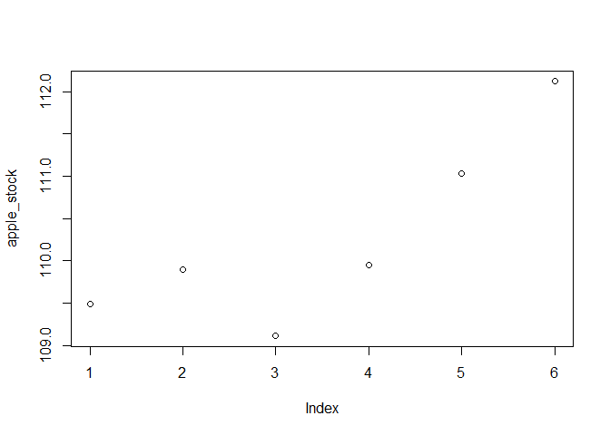
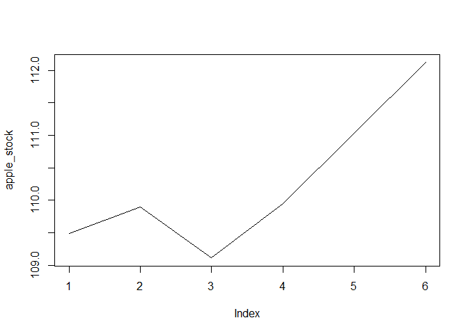
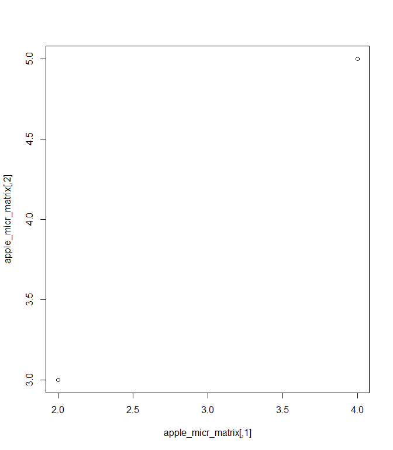
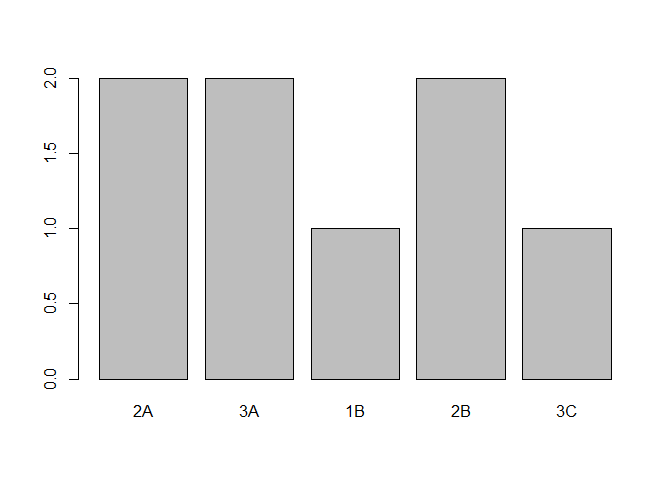
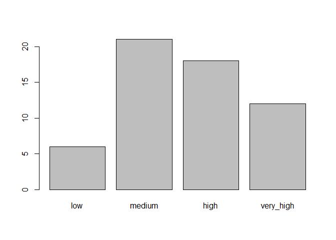
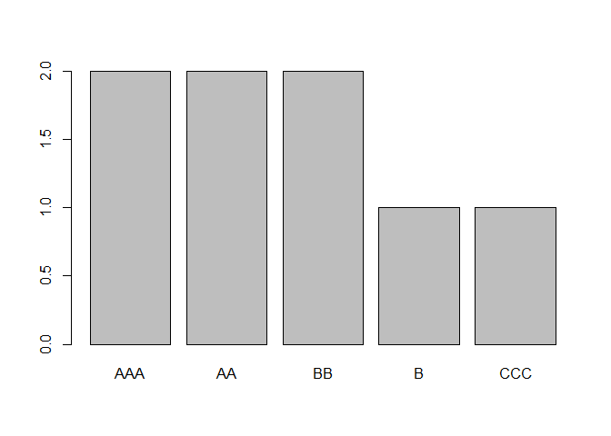
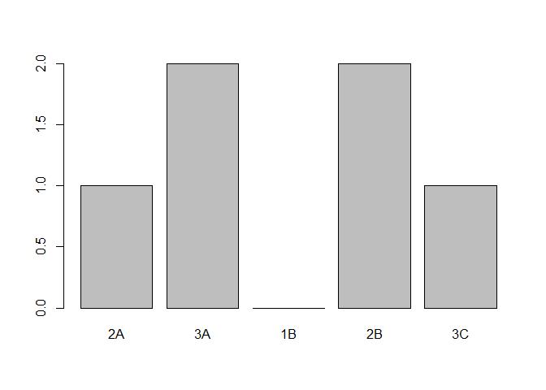
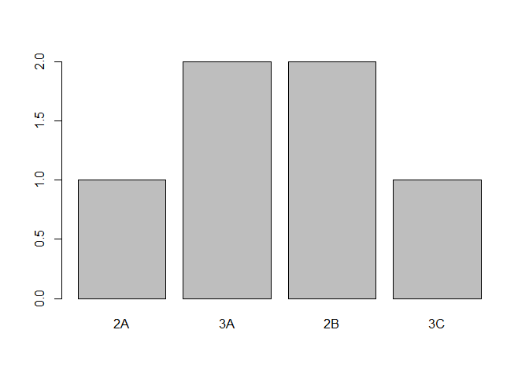

# Introduction to R for Finance!
\newpage

## The Basics

Arithmetic in R

* Addition: + 
* Subtraction: -
* Multiplication: *
* Division: /
* Exponentiation: ^ or **
* Modulo: %%


```r
setwd("C:/Users/maiam/Dropbox/ABRIL-MAIO 2020/PYTHON/PORTFOLIO/TUTORIALS/r/Introduction to R for Finance")
# Addition 
2 + 2
```

```
## [1] 4
```

```r
# Subtraction
4 - 1
```

```
## [1] 3
```

```r
# Multiplication
3 * 4
```

```
## [1] 12
```

```r
# Division
4/2
```

```
## [1] 2
```

```r
# Exponentiation
2^4
```

```
## [1] 16
```

```r
# Modulo
7%%3
```

```
## [1] 1
```

##Variables

A variable allows us to store a value or an object in R. We can then later use this variable's name to easily access the value or the object that is stored within this variable. E.g:my_walet <- 100


```r
# Assign 200 to savings
savings <- 200
# Print the value of savings to the console
savings
```

```
## [1] 200
```

```r
######Aritmetrics with variables

# Assign 500 to my_money
my_money <- 500

# Assign 200 to dans_money
dans_money<-200

# Add my_money and dans_money
my_money+dans_money
```

```
## [1] 700
```

```r
# Add my_money and dans_money again, save the result to our_money
our_money<-my_money+dans_money
print(our_money)
```

```
## [1] 700
```

## Financial Aplication: Calculating financial returns 

Assume you have $200. During January, you make a 5% return on that money. How much do you have at the end of January? 
Well, you have 100% of your starting money, plus another 5%: **100% + 5% = 105%**. 
In decimals, this is **1 + .05 = 1.05**. This 1.05 is the return multiplier for January, and you multiply your original $100 by it to get the amount you have at the end of January.

If, in February, you earn another 2% on your cash, how would you calculate the total amount at the end of February? You already know that the amount at the end of January is **$100 * 1.05 = $105**. To get from the end of January to the end of February, just use another multiplier! **$105 * 1.02 = $107.1**

A quick way to get the multiplier is:
<center> $multiplier = 1 + (return / 100)$</center>


```r
# Variables for starting_cash and 5% return during January
starting_cash <- 200
jan_ret <- 5
jan_mult <- 1 + (jan_ret / 100)

# How much money do you have at the end of January?
post_jan_cash <- starting_cash*jan_mult
# Print post_jan_cash
post_jan_cash
```

```
## [1] 210
```

```r
# January 10% return multiplier
jan_ret_10 <- 10
jan_mult_10 <- 1+(jan_ret_10/100)
# How much money do you have at the end of January now?
post_jan_cash_10 <- starting_cash*jan_mult_10
# Print post_jan_cash_10
post_jan_cash_10
```

```
## [1] 220
```

```r
# Starting cash and returns 
starting_cash <- 200
jan_ret <- 4
feb_ret <- 5
# Multipliers
jan_mult <- 1+(jan_ret/100)
feb_mult <- 1+feb_ret/100
# Total cash at the end of the two months
total_cash <- starting_cash*jan_mult*feb_mult
# Print total_cash
total_cash
```

```
## [1] 218.4
```
## Data type's

**What's that data type?**

```r
# company's stock price is a numeric
company_stock <- 150.45
class(company_stock)
```

```
## [1] "numeric"
```

```r
# Bond credit ratings are characters
credit_rating <-"AAA"
class(credit_rating)
```

```
## [1] "character"
```

```r
# You like the stock market. TRUE or FALSE?
my_answer <- TRUE
class(my_answer)
```

```
## [1] "logical"
```

```r
# Print my_answer
my_answer
```

```
## [1] TRUE
```
\pagebreak

###Working with Vectors


```r
# numeric vector
ibm_stock <- c(159.82, 160.02, 159.84)

# character vector
finance <-c("stocks", "bonds", "investments")

# A logical vector
logic <- c(TRUE,FALSE,TRUE)

# Vectors of 12 months of returns, and month names
ret <- c(5, 2, 3, 7, 8, 3, 5, 9, 1, 4, 6, 3)
months <- c("Jan", "Feb", "Mar", "Apr", "May", "Jun", "Jul", "Aug", "Sep", "Oct", "Nov", "Dec")

# Naming the vector ret
names(ret) <- months
# Print out ret to see the new names!
ret
```

```
## Jan Feb Mar Apr May Jun Jul Aug Sep Oct Nov Dec 
##   5   2   3   7   8   3   5   9   1   4   6   3
```

# Visualizing financial data


```r
apple_stock <- c(109.49, 109.90, 109.11, 109.95, 111.03, 112.12)
credit_rating <- c("AAA", "AA", "BBB", "BB", "B")
micr<-c(59.20,59.25,60.22,59.95,61.37,61.01,61.97,62.17,62.98,62.68,62.58,62.30
,63.62,63.54,63.54,63.55,63.24,63.28,62.99,62.90,62.14)
# Look at the data
apple_stock
```

```
## [1] 109.49 109.90 109.11 109.95 111.03 112.12
```

```r
# Plot the data points
plot(apple_stock)
```

<!-- -->

```r
# Plot the data as a line graph
plot(apple_stock, type = "l")
```

<!-- -->

# Weighted average

The weighted average allows you to calculate your portfolio return over a time period. Consider the following example:
Assume you have 40% of your cash in Apple stock, and 60% of your cash in IBM stock. If, in January, Apple earned 5% and IBM earned 7%, what was your total portfolio return?
To calculate this, take the return of each stock in your portfolio, and multiply it by the weight of that stock. Then sum up all of the results. For this example, you would do:

$6.2 = 5 * .4 + 7 * .6$ Or, in variable terms:

$portf_ret <- apple_ret * apple_weight + ibm_ret * ibm_weight$


```r
# Weights and returns
micr_ret<- 7
sony_ret <- 9
micr_weight <- .2
sony_weight <- .8

# Portfolio return
portf_ret <-micr_ret * micr_weight + sony_ret * sony_weight
# Weights, returns, and company names
ret <- c(7, 9)
weight <- c(.2, .8)
companies <- c("Microsoft", "Sony")

# Assign company names to your vectors
names(ret) <- companies
names(weight) <- companies
# Multiply the returns and weights together 
ret_X_weight <- ret*weight
# Print ret_X_weight
ret_X_weight
```

```
## Microsoft      Sony 
##       1.4       7.2
```

```r
# Sum to get the total portfolio return
portf_ret <-sum(ret_X_weight)

# Print portf_ret
sum(portf_ret)
```

```
## [1] 8.6
```

```r
# Print ret
ret 
```

```
## Microsoft      Sony 
##         7         9
```

```r
# Assign 1/3 to weight
weight <- 1/3
# Create ret_X_weight
ret_X_weight <- ret*weight
# Calculate your portfolio return
portf_ret <- sum(ret_X_weight)
# Vector of length 3 * Vector of length 2?
ret * c(.2, .6)
```

```
## Microsoft      Sony 
##       1.4       5.4
```

# subsetting

Sometimes, you will only want to use specific pieces of your vectors, and you'll need some way to access just those parts. For example, what if you only wanted the first month of returns from the vector of 12 months of returns? To solve this, you can subset the vector using [ ].

Here is the 12 month return vector:

**ret <- c(5, 2, 3, 7, 8, 3, 5, 9, 1, 4, 6, 3)**

1. Select the first month: ret[1].
2. Select the first month by name: ret["Jan"].
3. Select the first three months: ret[1:3] or ret[c(1, 2, 3)].


```r
ret <- c(5, 2, 3, 7, 8, 3, 5, 9, 1, 4, 6, 3)

# First 6 months of returns
ret[1:6]
```

```
## [1] 5 2 3 7 8 3
```

```r
# Just March and May
ret[c("Mar","May")]
```

```
## [1] NA NA
```

```r
# Omit the first month of returns
ret[-1]
```

```
##  [1] 2 3 7 8 3 5 9 1 4 6 3
```

# Matrix

Matrices are similar to vectors, except they are in 2 dimensions! Let's create a 2x2 matrix "by hand" using matrix().


```r
# A vector of 9 numbers
my_vector <- c(1, 2, 3, 4, 5, 6, 7, 8, 9)
# 3x3 matrix
my_matrix <- matrix(data = my_vector, nrow = 3, ncol =3)
# Print my_matrix
my_matrix
```

```
##      [,1] [,2] [,3]
## [1,]    1    4    7
## [2,]    2    5    8
## [3,]    3    6    9
```

```r
# Filling across using byrow = TRUE
apple_micr_matrix<-matrix(data = c(2, 3, 4, 5), nrow = 2, ncol = 2, byrow = TRUE)
# View the data
apple_micr_matrix
```

```
##      [,1] [,2]
## [1,]    2    3
## [2,]    4    5
```

```r
# Scatter plot of Microsoft vs Apple
plot(apple_micr_matrix)
```

<!-- -->
# correlation


```r
apple <- c(109.49, 109.90, 109.11, 109.95, 111.03)
ibm <- c(159.82, 160.02, 159.84, 160.35, 164.79)

# cbind the vectors together
cbind_stocks <- cbind(apple,ibm,micr)
```

```
## Warning in cbind(apple, ibm, micr): number of rows of result is not a
## multiple of vector length (arg 1)
```

```r
# Print cbind_stocks
cbind_stocks
```

```
##        apple    ibm  micr
##  [1,] 109.49 159.82 59.20
##  [2,] 109.90 160.02 59.25
##  [3,] 109.11 159.84 60.22
##  [4,] 109.95 160.35 59.95
##  [5,] 111.03 164.79 61.37
##  [6,] 109.49 159.82 61.01
##  [7,] 109.90 160.02 61.97
##  [8,] 109.11 159.84 62.17
##  [9,] 109.95 160.35 62.98
## [10,] 111.03 164.79 62.68
## [11,] 109.49 159.82 62.58
## [12,] 109.90 160.02 62.30
## [13,] 109.11 159.84 63.62
## [14,] 109.95 160.35 63.54
## [15,] 111.03 164.79 63.54
## [16,] 109.49 159.82 63.55
## [17,] 109.90 160.02 63.24
## [18,] 109.11 159.84 63.28
## [19,] 109.95 160.35 62.99
## [20,] 111.03 164.79 62.90
## [21,] 109.49 159.82 62.14
```

```r
# rbind the vectors together
rbind_stocks <- rbind(apple,ibm,micr)
```

```
## Warning in rbind(apple, ibm, micr): number of columns of result is not a
## multiple of vector length (arg 1)
```

```r
# Print rbind_stocks
rbind_stocks
```

```
##         [,1]   [,2]   [,3]   [,4]   [,5]   [,6]   [,7]   [,8]   [,9]
## apple 109.49 109.90 109.11 109.95 111.03 109.49 109.90 109.11 109.95
## ibm   159.82 160.02 159.84 160.35 164.79 159.82 160.02 159.84 160.35
## micr   59.20  59.25  60.22  59.95  61.37  61.01  61.97  62.17  62.98
##        [,10]  [,11]  [,12]  [,13]  [,14]  [,15]  [,16]  [,17]  [,18]
## apple 111.03 109.49 109.90 109.11 109.95 111.03 109.49 109.90 109.11
## ibm   164.79 159.82 160.02 159.84 160.35 164.79 159.82 160.02 159.84
## micr   62.68  62.58  62.30  63.62  63.54  63.54  63.55  63.24  63.28
##        [,19]  [,20]  [,21]
## apple 109.95 111.03 109.49
## ibm   160.35 164.79 159.82
## micr   62.99  62.90  62.14
```

## Matrix subsetting


```r
stocks<-cbind_stocks
# Third row
stocks[3,]
```

```
##  apple    ibm   micr 
## 109.11 159.84  60.22
```

```r
# Fourth and fifth row of the ibm column
stocks[c(4,5),"ibm"]
```

```
## [1] 160.35 164.79
```

```r
# apple and micr columns
stocks[,c("apple","micr")]
```

```
##        apple  micr
##  [1,] 109.49 59.20
##  [2,] 109.90 59.25
##  [3,] 109.11 60.22
##  [4,] 109.95 59.95
##  [5,] 111.03 61.37
##  [6,] 109.49 61.01
##  [7,] 109.90 61.97
##  [8,] 109.11 62.17
##  [9,] 109.95 62.98
## [10,] 111.03 62.68
## [11,] 109.49 62.58
## [12,] 109.90 62.30
## [13,] 109.11 63.62
## [14,] 109.95 63.54
## [15,] 111.03 63.54
## [16,] 109.49 63.55
## [17,] 109.90 63.24
## [18,] 109.11 63.28
## [19,] 109.95 62.99
## [20,] 111.03 62.90
## [21,] 109.49 62.14
```

# data.frame()


```r
# Variables
company <- c("A", "A", "A", "B", "B", "B", "B")
cash_flow <- c(1000, 4000, 550, 1500, 1100, 750, 6000)
year <- c(1, 3, 4, 1, 2, 4, 5)

# Data frame
cash <- data.frame(company,cash_flow,year)

# Print cash
cash
```

```
##   company cash_flow year
## 1       A      1000    1
## 2       A      4000    3
## 3       A       550    4
## 4       B      1500    1
## 5       B      1100    2
## 6       B       750    4
## 7       B      6000    5
```

## inspect your dataframe
head() and tail()s of your data with some str()structure


```r
# Call head() for the first 4 rows
head(cash,n=4)
```

```
##   company cash_flow year
## 1       A      1000    1
## 2       A      4000    3
## 3       A       550    4
## 4       B      1500    1
```

```r
# Call tail() for the last 3 rows
tail(cash,n=3)
```

```
##   company cash_flow year
## 5       B      1100    2
## 6       B       750    4
## 7       B      6000    5
```

```r
# Call str()
str(cash)
```

```
## 'data.frame':	7 obs. of  3 variables:
##  $ company  : Factor w/ 2 levels "A","B": 1 1 1 2 2 2 2
##  $ cash_flow: num  1000 4000 550 1500 1100 750 6000
##  $ year     : num  1 3 4 1 2 4 5
```

## Naming your columns / rows

```r
# Fix your column names
colnames(cash)<-c("company","cash_flow","year")

# Print out the column names of cash
names(cash)
```

```
## [1] "company"   "cash_flow" "year"
```
## Accessing and subsetting data frames (1)


```r
# Third row, second column
cash[3,2]
```

```
## [1] 550
```

```r
# Fifth row of the "year" column
cash[5,"year"]
```

```
## [1] 2
```

```r
# Select the year column
cash$year
```

```
## [1] 1 3 4 1 2 4 5
```

```r
# Select the cash_flow column and multiply by 2
cash$cash_flow*2
```

```
## [1]  2000  8000  1100  3000  2200  1500 12000
```

```r
# Delete the company column
cash$company <- NULL
# Print cash again
cash
```

```
##   cash_flow year
## 1      1000    1
## 2      4000    3
## 3       550    4
## 4      1500    1
## 5      1100    2
## 6       750    4
## 7      6000    5
```

```r
# Rows about company B
subset(cash,company=="B")
```

```
##   cash_flow year
## 4      1500    1
## 5      1100    2
## 6       750    4
## 7      6000    5
```

```r
# Rows with cash flows due in 1 year
subset(cash,year==1)
```

```
##   cash_flow year
## 1      1000    1
## 4      1500    1
```

## Adding new columns


```r
# Quarter cash flow scenario
cash$quarter_cash <-cash$cash_flow*0.25

# Double year scenario
cash$double_year<-cash$year*2
```

# Present value of projected cash flows


```r
# Present value of $4000, in 3 years, at 5%
present_value_4k <- 4000*(1+0.05)^-3
# Present value of all cash flows
cash$present_value <-cash$cash_flow*(1+0.05)^-cash$year
# Print out cash
cash
```

```
##   cash_flow year quarter_cash double_year present_value
## 1      1000    1        250.0           2      952.3810
## 2      4000    3       1000.0           6     3455.3504
## 3       550    4        137.5           8      452.4864
## 4      1500    1        375.0           2     1428.5714
## 5      1100    2        275.0           4      997.7324
## 6       750    4        187.5           8      617.0269
## 7      6000    5       1500.0          10     4701.1570
```

```r
# Total present value of cash
total_pv <- sum(cash$present_value)
# Company B information
cash_B <- subset(cash,company=="B")
# Total present value of cash_B
total_pv_B <- sum(cash_B$present_value)
```

# Factor


```r
# credit_rating character vector
credit_rating <- c("BB", "AAA", "AA", "CCC", "AA", "AAA", "B", "BB")

# Create a factor from credit_rating
credit_factor <- factor(credit_rating)

# Print out your new factor
credit_factor
```

```
## [1] BB  AAA AA  CCC AA  AAA B   BB 
## Levels: AA AAA B BB CCC
```

```r
# Call str() on credit_rating
str(credit_rating)
```

```
##  chr [1:8] "BB" "AAA" "AA" "CCC" "AA" "AAA" "B" "BB"
```

```r
# Call str() on credit_factor
str(credit_factor)
```

```
##  Factor w/ 5 levels "AA","AAA","B",..: 4 2 1 5 1 2 3 4
```

```r
# Identify unique levels
levels(credit_factor)
```

```
## [1] "AA"  "AAA" "B"   "BB"  "CCC"
```

```r
# Rename the levels of credit_factor
levels(credit_factor)<-c("2A","3A","1B","2B","3C")

# Print credit_factor
credit_factor
```

```
## [1] 2B 3A 2A 3C 2A 3A 1B 2B
## Levels: 2A 3A 1B 2B 3C
```

## Factor summary


```r
# Summarize the character vector, credit_rating
summary(credit_rating)
```

```
##    Length     Class      Mode 
##         8 character character
```

```r
# Summarize the factor, credit_factor
summary(credit_factor)
```

```
## 2A 3A 1B 2B 3C 
##  2  2  1  2  1
```

## Visualize your factor


```r
# Visualize your factor!
plot(credit_factor)
```

<!-- -->
## Bucketing a numeric variable into a factor


```r
AAA_rank<-c(31,48,100,53,85,73,62,74,42,38,97,61,48,86,44,9,43,18,62,31,48,100,53,85,73,62,74,42,38,97,61,48,86,44,9,43,18,62,31,48,100,53,85,73,62,74,42,38,97,61,48,86,44,9,43,18,62)
AAA_factor <- cut(x = AAA_rank, breaks = c(0, 20, 40, 60, 80, 100))
head(AAA_factor)
```

```
## [1] (20,40]  (40,60]  (80,100] (40,60]  (80,100] (60,80] 
## Levels: (0,20] (20,40] (40,60] (60,80] (80,100]
```

```r
# Create 4 buckets for AAA_rank using cut()
AAA_factor <- cut(x = AAA_rank, breaks = c(0,25,50,75,100))

# Rename the levels 
levels(AAA_factor)<-c("low","medium","high","very_high")

# Print AAA_factor
AAA_factor
```

```
##  [1] medium    medium    very_high high      very_high high      high     
##  [8] high      medium    medium    very_high high      medium    very_high
## [15] medium    low       medium    low       high      medium    medium   
## [22] very_high high      very_high high      high      high      medium   
## [29] medium    very_high high      medium    very_high medium    low      
## [36] medium    low       high      medium    medium    very_high high     
## [43] very_high high      high      high      medium    medium    very_high
## [50] high      medium    very_high medium    low       medium    low      
## [57] high     
## Levels: low medium high very_high
```

```r
# Plot AAA_factor
plot(AAA_factor)
```

<!-- -->
## Create an ordered factor


```r
# Use unique() to find unique words
unique(credit_rating)
```

```
## [1] "BB"  "AAA" "AA"  "CCC" "B"
```

```r
# Create an ordered factor
credit_factor_ordered <- factor(credit_rating, ordered = TRUE, levels = c("AAA","AA","BB","B","CCC"))

# Plot credit_factor_ordered
plot(credit_factor_ordered)
```

<!-- -->

## Subsetting a factor


```r
# Remove the A bonds at positions 3 and 7. Don't drop the A level.
keep_level <- credit_factor[-c(3,7)]

# Plot keep_level
plot(keep_level)
```

<!-- -->

```r
# Remove the A bonds at positions 3 and 7. Drop the A level.
drop_level <-credit_factor[-c(3,7),drop="TRUE"]

# Plot drop_level
plot(drop_level)
```

<!-- -->
## strings as factors


```r
# Variables
credit_rating <- c("AAA", "A", "BB")
bond_owners <- c("Dan", "Tom", "Joe")
# Create the data frame of character vectors, bonds
bonds <-data.frame(credit_rating,bond_owners,stringsAsFactors = FALSE)
# Use str() on bonds
str(bonds)
```

```
## 'data.frame':	3 obs. of  2 variables:
##  $ credit_rating: chr  "AAA" "A" "BB"
##  $ bond_owners  : chr  "Dan" "Tom" "Joe"
```

```r
# Create a factor column in bonds called credit_factor from credit_rating
bonds$credit_factor <- factor(bonds$credit_rating, ordered = TRUE, levels = c("AAA","A","BB"))
# Use str() on bonds again
str(bonds)
```

```
## 'data.frame':	3 obs. of  3 variables:
##  $ credit_rating: chr  "AAA" "A" "BB"
##  $ bond_owners  : chr  "Dan" "Tom" "Joe"
##  $ credit_factor: Ord.factor w/ 3 levels "AAA"<"A"<"BB": 1 2 3
```

# List


```r
# List components
name <- "Apple and IBM"
apple <- c(109.49, 109.90, 109.11, 109.95, 111.03)
ibm <- c(159.82, 160.02, 159.84, 160.35, 164.79)
cor_matrix <- cor(cbind(apple, ibm))

# Create a list
portfolio <- list(name,apple,ibm,cor_matrix)

# View your first list
portfolio
```

```
## [[1]]
## [1] "Apple and IBM"
## 
## [[2]]
## [1] 109.49 109.90 109.11 109.95 111.03
## 
## [[3]]
## [1] 159.82 160.02 159.84 160.35 164.79
## 
## [[4]]
##           apple       ibm
## apple 1.0000000 0.9131575
## ibm   0.9131575 1.0000000
```
## Name the lists


```r
# Add names to your portfolio
names(portfolio)<-c("portfolio_name", "apple", "ibm", "correlation")

# Print portfolio
portfolio
```

```
## $portfolio_name
## [1] "Apple and IBM"
## 
## $apple
## [1] 109.49 109.90 109.11 109.95 111.03
## 
## $ibm
## [1] 159.82 160.02 159.84 160.35 164.79
## 
## $correlation
##           apple       ibm
## apple 1.0000000 0.9131575
## ibm   0.9131575 1.0000000
```

## Access elements in a list


```r
# Second and third elements of portfolio
portfolio[c(2,3)]
```

```
## $apple
## [1] 109.49 109.90 109.11 109.95 111.03
## 
## $ibm
## [1] 159.82 160.02 159.84 160.35 164.79
```

```r
# Use $ to get the correlation data
portfolio$correlation
```

```
##           apple       ibm
## apple 1.0000000 0.9131575
## ibm   0.9131575 1.0000000
```
## Adding elements to a list


```r
# Add weight: 20% Apple, 80% IBM
portfolio$weight <- c(apple = 0.2, ibm = 0.8)
# Print portfolio
portfolio
```

```
## $portfolio_name
## [1] "Apple and IBM"
## 
## $apple
## [1] 109.49 109.90 109.11 109.95 111.03
## 
## $ibm
## [1] 159.82 160.02 159.84 160.35 164.79
## 
## $correlation
##           apple       ibm
## apple 1.0000000 0.9131575
## ibm   0.9131575 1.0000000
## 
## $weight
## apple   ibm 
##   0.2   0.8
```

```r
# Change the weight variable: 30% Apple, 70% IBM
portfolio$weight<- c(apple = 0.3, ibm = 0.7)
# Print portfolio to see the changes
portfolio
```

```
## $portfolio_name
## [1] "Apple and IBM"
## 
## $apple
## [1] 109.49 109.90 109.11 109.95 111.03
## 
## $ibm
## [1] 159.82 160.02 159.84 160.35 164.79
## 
## $correlation
##           apple       ibm
## apple 1.0000000 0.9131575
## ibm   0.9131575 1.0000000
## 
## $weight
## apple   ibm 
##   0.3   0.7
```
## Removing elements from a list


```r
# Take a look at portfolio
portfolio
```

```
## $portfolio_name
## [1] "Apple and IBM"
## 
## $apple
## [1] 109.49 109.90 109.11 109.95 111.03
## 
## $ibm
## [1] 159.82 160.02 159.84 160.35 164.79
## 
## $correlation
##           apple       ibm
## apple 1.0000000 0.9131575
## ibm   0.9131575 1.0000000
## 
## $weight
## apple   ibm 
##   0.3   0.7
```

```r
# Remove the microsoft stock prices from your portfolio
portfolio$microsoft<-NULL
portfolio
```

```
## $portfolio_name
## [1] "Apple and IBM"
## 
## $apple
## [1] 109.49 109.90 109.11 109.95 111.03
## 
## $ibm
## [1] 159.82 160.02 159.84 160.35 164.79
## 
## $correlation
##           apple       ibm
## apple 1.0000000 0.9131575
## ibm   0.9131575 1.0000000
## 
## $weight
## apple   ibm 
##   0.3   0.7
```

## Split a list


```r
# Define grouping from year
grouping <- cash$year
# Split cash on your new grouping
split_cash <- split(cash,grouping)
# Look at your split_cash list
split_cash
```

```
## $`1`
##   cash_flow year quarter_cash double_year present_value
## 1      1000    1          250           2       952.381
## 4      1500    1          375           2      1428.571
## 
## $`2`
##   cash_flow year quarter_cash double_year present_value
## 5      1100    2          275           4      997.7324
## 
## $`3`
##   cash_flow year quarter_cash double_year present_value
## 2      4000    3         1000           6       3455.35
## 
## $`4`
##   cash_flow year quarter_cash double_year present_value
## 3       550    4        137.5           8      452.4864
## 6       750    4        187.5           8      617.0269
## 
## $`5`
##   cash_flow year quarter_cash double_year present_value
## 7      6000    5         1500          10      4701.157
```

```r
# Unsplit split_cash to get the original data back.
original_cash <- unsplit(split_cash,grouping)
# Print original_cash
original_cash
```

```
##   cash_flow year quarter_cash double_year present_value
## 1      1000    1        250.0           2      952.3810
## 2      4000    3       1000.0           6     3455.3504
## 3       550    4        137.5           8      452.4864
## 4      1500    1        375.0           2     1428.5714
## 5      1100    2        275.0           4      997.7324
## 6       750    4        187.5           8      617.0269
## 7      6000    5       1500.0          10     4701.1570
```

Split-Apply-Combine


```r
# Print split_cash
split_cash
```

```
## $`1`
##   cash_flow year quarter_cash double_year present_value
## 1      1000    1          250           2       952.381
## 4      1500    1          375           2      1428.571
## 
## $`2`
##   cash_flow year quarter_cash double_year present_value
## 5      1100    2          275           4      997.7324
## 
## $`3`
##   cash_flow year quarter_cash double_year present_value
## 2      4000    3         1000           6       3455.35
## 
## $`4`
##   cash_flow year quarter_cash double_year present_value
## 3       550    4        137.5           8      452.4864
## 6       750    4        187.5           8      617.0269
## 
## $`5`
##   cash_flow year quarter_cash double_year present_value
## 7      6000    5         1500          10      4701.157
```

```r
# Print the cash_flow column of B in split_cash
split_cash$B$cash_flow
```

```
## NULL
```

```r
# Set the cash_flow column of company A in split_cash to 0
split_cash$A$cash_flow <-0
# Use the grouping to unsplit split_cash
cash_no_A <- unsplit(split_cash,grouping)
# Print cash_no_A
cash_no_A
```

```
##   cash_flow year quarter_cash double_year present_value
## 1      1000    1        250.0           2      952.3810
## 2      4000    3       1000.0           6     3455.3504
## 3       550    4        137.5           8      452.4864
## 4      1500    1        375.0           2     1428.5714
## 5      1100    2        275.0           4      997.7324
## 6       750    4        187.5           8      617.0269
## 7      6000    5       1500.0          10     4701.1570
```
# Attributes


```r
# my_matrix and my_factor
my_matrix <- matrix(c(1,2,3,4,5,6), nrow = 2, ncol = 3)
rownames(my_matrix) <- c("Row1", "Row2")
colnames(my_matrix) <- c("Col1", "Col2", "Col3")

my_factor <- factor(c("A", "A", "B"), ordered = T, levels = c("A", "B"))

# attributes of my_matrix
attributes(my_matrix)
```

```
## $dim
## [1] 2 3
## 
## $dimnames
## $dimnames[[1]]
## [1] "Row1" "Row2"
## 
## $dimnames[[2]]
## [1] "Col1" "Col2" "Col3"
```

```r
# Just the dim attribute of my_matrix
attr(my_matrix,"dim")
```

```
## [1] 2 3
```

```r
# attributes of my_factor
attributes(my_factor)
```

```
## $levels
## [1] "A" "B"
## 
## $class
## [1] "ordered" "factor"
```
