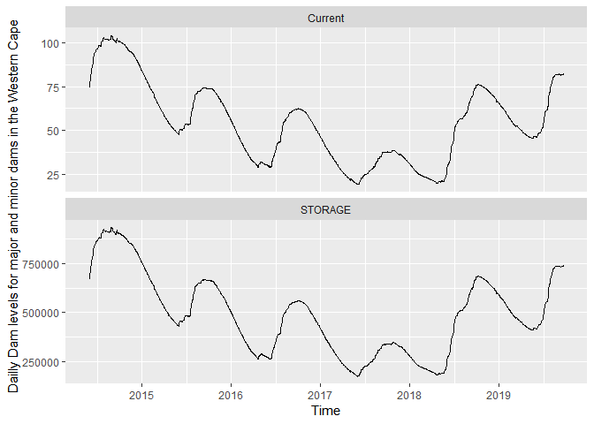

# Exploratory Time Series

Time Series are data that from the observation of a real phenomenon for a period of time. We have at our disposal, a wide range of tools and techniques to identify models that can help us to:

1. Describe relevant patterns on the time series;

2. Explain how the past can affect the future;

3. Explain how can two series can interact;

4. Forecast the future.

##Time Series Exploratory analysis

Usually the first step when analyzing a time series is to plot our data so we can visualize features such as the patterns, unusual observations, changes over time or relationship between variables. I this step it helps, if we answer the following questions:

1. Is there a trend over time? 
  + On average, the measurements tend to increase (or decrease) over time?
  + Is the trend Linear or Exponential?

2. Is there seasonality,
  + Is there a regularly repeating pattern of highs and lows related to calendar time such as seasons, quarters, months, days of the week?
  + Is the seasonal component increase in magnitude across time?


3. Are their outliers? In regression, outliers are far away from your line. With time series data, your outliers are far away from your other data.

4. Is there a long-run cycle or period unrelated to seasonality factors?

5. Is the variance non-constant? 
  + Are there any abrupt changes to either the level of the series or the variance?
  
To better be familiarized with time series exporatory analysis we have choose the following real data sets:

* OR Tambo South African Airport Monthly average Temperatures(2017-2019);

* Eskom Electricity sales to Mozambique(1996 - 2006);

* Rwanda annual GDP. 1960-2018;

* Daily Dam levels for major and minor dams in the Western Cape water supply system. 2011-2019;

* And Daily closing Shoprite stock prices.

On the present article we will use the r, the following post covers the same steps in python.
1. Install and load libraries;
2. Import Data set using functions such as [read_csv()](https://readr.tidyverse.org/reference/read_delim.html) to import the csv file and [getSymbols()](https://www.rdocumentation.org/packages/quantmod/versions/0.4-15/topics/getSymbols) function.

3. Create Time Series Object using [ts()](https://www.rdocumentation.org/packages/stats/versions/3.6.1/topics/ts) function or [xts()](https://www.rdocumentation.org/packages/xts/versions/0.11-2/topics/xts) function.

2. Manipulate and plot the data set using the
  [plot.ts() function](https://cran.r-project.org/web/packages/ggfortify/vignettes/plot_ts.html) or[plot.ts](https://www.uni-muenster.de/ZIV.BennoSueselbeck/s-html/helpfiles/ts.plot.html)...
  
3. Analyse.


### Or Tambo Monthly Average Temperatures


```r
#Import Data 
temp<-read_csv("https://www.dropbox.com/s/pf9ah91vrirzs8m/ORTamboTemp.csv?dl=1", skip=3)
```

```
## Parsed with column specification:
## cols(
##   Temp = col_double()
## )
```

```r
#Create a time series object
ORtemp<-ts(temp,start=2017, frequency=12)#this makes sure R knows that temp is a time series, starting Jan 2017 with a Monthly frequence
#Visualize tem created object
ORtemp
```

```
##      Jan Feb Mar Apr May Jun Jul Aug Sep Oct Nov Dec
## 2017  22  22  21  19  16  14  15  15  20  21  22  23
## 2018  22  21  19  16  14  13  17  21  22  24  23  22
## 2019  23  18  17  13  13  16  18
```

```r
#Plot the ts object
autoplot(ORtemp,colour = 'blue') + 
  ggtitle("O. R. Tambo temperatures time series") + 
  geom_hline(yintercept=mean(ORtemp), color = "red")+ #add a mean horizontal line 
  xlab("Time (Year)") + 
  ylab("Temperatures (C)") +
  theme_bw() +
  theme(plot.title = element_text(hjust = 0.5)) 
```

<!-- -->

```r
#Plot the Monthly Data
monthplot(ORtemp,ylab="Average Temperature cº",xlab="Month",xaxt="n",main="Monthly Average Temperatures")
axis(1,at=1:12,labels=month.abb,cex=0.8)
```

<!-- -->
 
Analysist

1. Trend: yes(do not have a constant mean-using the abline we can evaluate if there is a trend or not)
sazonalyty:yes
 + Outliers: No
 + cycle: No
 + variance: do not have a constant variance

### Anual Eskom Electricity Sales to Mozambique from 1996 to 2006
Eskom is a South African electricity public utility, established in 1923 as the Electricity Supply Commission (ESCOM). The utility is the largest producer of electricity in Africa exporting electricity to Botswana, Mozambique, Namibia, Zimbabwe, Lesotho, Swaziland	and Zambia.
Our dataset is a subset of the [Eskom Table - Table 2.csv](http://energydata.uct.ac.za/dataset/eskom-holdings-limited-annual-report/resource/18894e94-873e-4617-95f2-b6fa2e3131f4)


```r
#Importing Data
Elecsales<-read_csv("https://www.dropbox.com/s/950n1na0omcvi7n/eskom-table-table-2_Mozambique.csv?dl=1", skip=3)
```

```
## Parsed with column specification:
## cols(
##   Sales = col_double()
## )
```

```r
#Create a ts ttime series object
Elecsales<-ts(Elecsales,start=1996, frequency=1)
Elecsales
```

```
## Time Series:
## Start = 1996 
## End = 2006 
## Frequency = 1 
##       Sales
##  [1,]   596
##  [2,]   680
##  [3,]   385
##  [4,]    68
##  [5,]  1331
##  [6,]  3899
##  [7,]  3907
##  [8,]  5875
##  [9,]  8076
## [10,] 10108
## [11,]  8167
```

```r
plot.ts(Elecsales,type="b",xlab="Time",ylab="Annual Eskom Electric Sales for Mozambique in GWh") #time series plot of temp with points market as bubbles
abline(h=mean(Elecsales)) # the mean value of the time serie
```

<!-- -->
 
Analysist

 + Trend: Yes(Mean not constan across the time)
 + sazonalyty: No (we are working with annual data)
 + Outliers: No
 + cycle: No
 + variance: Constant

### Rwanda Annual GDP


```r
#Import data
RWGDP<-read_csv("https://www.dropbox.com/s/hn21pmpjruayl23/RWA_GDP_WORLD_bANK.csv?dl=1", skip=3)
```

```
## Parsed with column specification:
## cols(
##   `GDP (current US$)` = col_double()
## )
```

```r
#Create a ts object
RWGDP<-ts(RWGDP, start=1960, frequency=1)
#inspect the ts object
str(RWGDP)
```

```
##  Time-Series [1:59, 1] from 1960 to 2018: 1.19e+08 1.22e+08 1.25e+08 1.28e+08 1.30e+08 ...
##  - attr(*, "dimnames")=List of 2
##   ..$ : NULL
##   ..$ : chr "GDP (current US$)"
```

```r
#Plot the data using plot.ts

autoplot(RWGDP,xlab="Year",ylab="Annual Rwanda GDP 1960-2018") #time series plot of temp with points market as bubbles
```

<!-- -->

## Dam levels for major and minor dams in the Western Cape water supply system. 2011-2019

The Western Cape Water Supply System (WCWSS) is a complex water supply system in the Western Cape region of South Africa, comprising an inter-linked system of six main dams, pipelines, tunnels and distribution networks, and a number of minor dams, some owned and operated by the Department of Water and Sanitation and some by the City of Cape Town.[1]
The principal dams are all located in the Cape Fold Mountains to the east of Cape Town. They are:

Theewaterskloof Dam
Wemmershoek Dam
Steenbras Dams (Upper and lower)
Voëlvlei Dam
Berg River Dam
These six major dams provide 99.6% of the combined storage capacity, and 8 minor dams the remaining 0.4%. The levels of these dams are recorded and published in weekly reports by the Department of Water and Sanitation.
Water crisis 2015-present
Beginning in 2015, a drought resulted in a severe water shortage in the area, with dam levels declining to critically low levels, and Cape Town announcing plans for "Day Zero", when municipal water supply would have to be shut off.[9] Water conservation and demand management was implemented, with increasingly severe water restrictions to both agriculture and urban use. Emergency augmentation measures including groundwater extraction from aquifers and desalination projects are underway.[10] Through water saving and augmentation measures, by March 2018 the City had reduced its daily water consumption by more than half to around 500 million litres per day, resulting in the initial prediction of Day Zero in April 2018 being pushed back to 2019. The situation, however, remains severe, particularly if the run of record dry winters continues through 2018.
 

```r
DamLevels<-read_csv("https://www.dropbox.com/s/0mj1dru4cn53jnj/Dam%20levels%202012%20to%202019.csv?dl=1")
```

```
## Parsed with column specification:
## cols(
##   DATE = col_character(),
##   STORAGE = col_double(),
##   Current = col_double()
## )
```

```r
DamLevels<-column_to_rownames(DamLevels, var = "DATE")
DamLevels<-xts(DamLevels, order.by =as.Date(rownames(DamLevels),format="%d-%b-%y") )
tail(DamLevels)
```

```
##            STORAGE Current
## 2019-09-18  736670    82.0
## 2019-09-19  736574    82.0
## 2019-09-20  735718    81.9
## 2019-09-21  736985    82.0
## 2019-09-22  738124    82.2
## 2019-09-23  738870    82.3
```

```r
autoplot(DamLevels["2014-06/2019-09"],xlab="Time",ylab="Dailly Dam levels for major and minor dams in the Western Cape") #time series plot of temp with points market as bubbles
```

<!-- -->

```r
#Trend - maybe, seasonality - yes, outlier - maybe
#abline(h=mean(DamLevels))
```
 
Analysist

 + Trend: Yes
 + sazonality:No
 + Outliers: No
 + cycle: Yes
 + variance:Constant


##Daily closing Shoprite stock prices

```r
# Import Shoprite Holdings Limited SRGHY data from Yahoo! Finance
getSymbols("SRGHY", auto.assign = TRUE)
```

```
## 'getSymbols' currently uses auto.assign=TRUE by default, but will
## use auto.assign=FALSE in 0.5-0. You will still be able to use
## 'loadSymbols' to automatically load data. getOption("getSymbols.env")
## and getOption("getSymbols.auto.assign") will still be checked for
## alternate defaults.
## 
## This message is shown once per session and may be disabled by setting 
## options("getSymbols.warning4.0"=FALSE). See ?getSymbols for details.
```

```
## 
## WARNING: There have been significant changes to Yahoo Finance data.
## Please see the Warning section of '?getSymbols.yahoo' for details.
## 
## This message is shown once per session and may be disabled by setting
## options("getSymbols.yahoo.warning"=FALSE).
```

```
## [1] "SRGHY"
```

```r
# Look at the structure of the object getSymbols created
str(SRGHY)
```

```
## An 'xts' object on 2010-01-20/2021-01-21 containing:
##   Data: num [1:2771, 1:6] 17.9 18 18 18.1 18.2 ...
##  - attr(*, "dimnames")=List of 2
##   ..$ : NULL
##   ..$ : chr [1:6] "SRGHY.Open" "SRGHY.High" "SRGHY.Low" "SRGHY.Close" ...
##   Indexed by objects of class: [Date] TZ: UTC
##   xts Attributes:  
## List of 2
##  $ src    : chr "yahoo"
##  $ updated: POSIXct[1:1], format: "2021-01-22 08:41:00"
```

```r
# Extract the close column
ShopriteClose=Cl(SRGHY)


#Plot 

autoplot(ShopriteClose["2017/2019-08"],xlab="Time",ylab="Dailly Shoprite Stock Close Price (2017-08/2019)") #time series plot of temp with points market as bubbles
```

<!-- -->

```r
#Trend - maybe, seasonality - yes, outlier - maybe
```


```r
## Food Price
rm(price)
```

```
## Warning in rm(price): object 'price' not found
```

```r
price<-read_csv("https://www.dropbox.com/s/kx58bp0kqoj6jht/Mozambique_foodprices.csv?dl=1", skip = 3)
```

```
## Parsed with column specification:
## cols(
##   adm0_id = col_double(),
##   adm0_name = col_character(),
##   adm1_id = col_double(),
##   adm1_name = col_logical(),
##   mkt_id = col_double(),
##   mkt_name = col_character(),
##   cm_id = col_double(),
##   cm_name = col_character(),
##   cur_id = col_double(),
##   cur_name = col_character(),
##   pt_id = col_double(),
##   pt_name = col_character(),
##   um_id = col_double(),
##   um_name = col_character(),
##   mp_month = col_double(),
##   mp_year = col_double(),
##   Date = col_character(),
##   mp_price = col_double()
## )
```

```r
price<-price[,-c(1:16)]
price<-column_to_rownames(price, var = "Date")
price1<-xts(price, order.by =as.Date(rownames(price), "%m/%d/%Y"),unique = FALSE)
head(price1)
```

```
##            mp_price
## 2003-04-01  33.6054
## 2003-05-01  17.6870
## 2003-06-01  35.3741
## 2003-07-01  29.6555
## 2003-08-01  12.5000
## 2003-09-01  12.6250
```
 
Analysist

 + Trend: 
 + sazonalyty:
 + Outliers: 
 + cycle:
 + variance: 


## Time Series Decomposition


@Manual{R-base,
  title = {Using R for Time Series Analysis},
  author = {{Avril Coghlan}},
  url = {https://a-little-book-of-r-for-time-series.readthedocs.io/en/latest/src/timeseries.html#time-series-analysis},
}

@Manual{R-base,
  title = {Forecasting: Principles and Practice},
  author = {{Rob J Hyndman, George Athanasopoulos}},
  organization = {Monash University},
  address = {Austria},
  year = {2016},
  url = {https://otexts.com/fpp2/},
}

https://en.wikipedia.org/wiki/Western_Cape_Water_Supply_System
